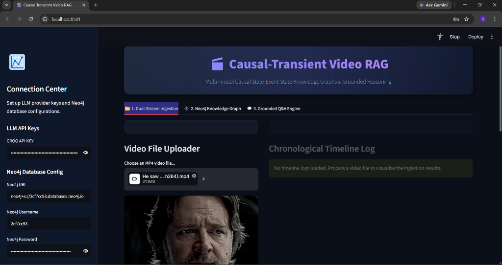
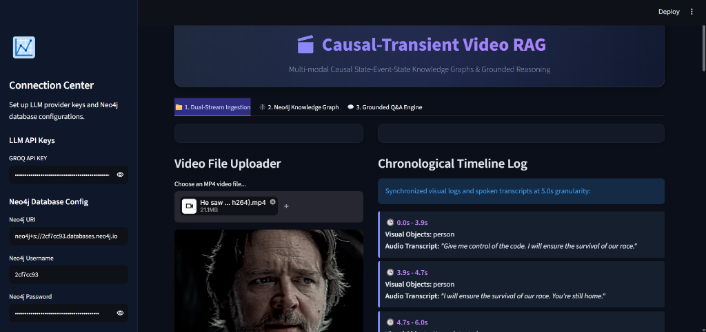
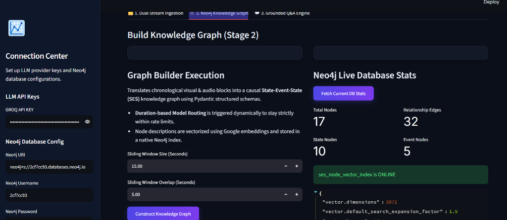
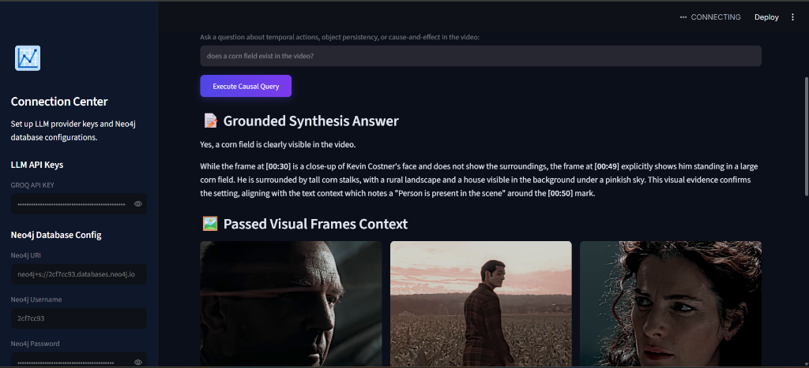
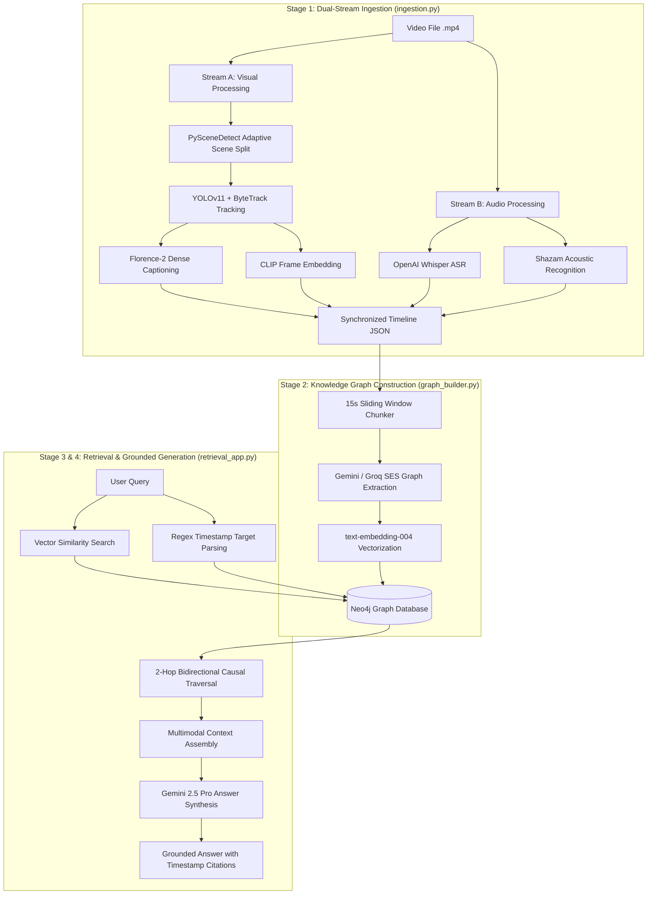

# 🎬 Video-RAG: Multimodal Causal Video Graph RAG

**Video-RAG** is an end-to-end Multimodal Video Retrieval-Augmented Generation (RAG) framework. It ingests video files using **dual-stream concurrent visual and audio processing**, builds a **State-Event-State (SES) Causal Knowledge Graph in Neo4j**, and delivers grounded answers with precise timestamp citations using **Vision-Language Models (Florence-2/CLIP)**, **Graph Neural Traversal**, and **LLMs (Gemini / Groq)**.

---

## 🎥 End-to-End Application & Output Video Demo

https://github.com/user-attachments/assets/demo_video.mp4 (stored in repository as [`assets/demo_video.mp4`](assets/demo_video.mp4))

<video src="assets/demo_video.mp4" controls="controls" width="100%">
  Your browser does not support HTML5 video playback. <a href="assets/demo_video.mp4">Click here to watch/download demo_video.mp4</a>
</video>

*Direct link to full demo video:* **[▶️ View / Download `assets/demo_video.mp4`](assets/demo_video.mp4)**

---

## 📸 Dashboard & User Interface Screenshots

| Stage 1: Video File Ingestion | Stage 1: Chronological Timeline Log |
| :---: | :---: |
|  |  |

| Stage 2: Neo4j Knowledge Graph Construction & Live Stats | Stage 3: Grounded Q&A Engine & Multimodal Frame Context |
| :---: | :---: |
|  |  |

---

## 🌟 Key Features

* 🎥 **Dual-Stream Concurrent Ingestion**: Simultaneously processes visual keyframes (YOLOv11 + Florence-2 VLM) and audio tracks (OpenAI Whisper + Shazam Music Recognition).
* 🧠 **State-Event-State (SES) Knowledge Graph**: Models video dynamics as structured causal graphs: `(State A) -[:PRECEDES]-> (Event) -[:CAUSES]-> (State B)` stored natively in **Neo4j**.
* 🔍 **Multimodal Vector & Graph Retrieval**: Combines Google `text-embedding-004` text vector search, **OpenAI CLIP** visual frame embeddings, and **Cypher 2-hop bidirectional causal traversal**.
* ⏱️ **Timestamp-Grounded Answer Synthesis**: Answers complex natural language queries with exact timestamp references (`[MM:SS]`), root-cause tracing, and visual frame proof.
* 💻 **Interactive Streamlit Web Dashboard**: Built-in web app (`app.py`) featuring real-time video upload, interactive graph visualizer (PyVis), and timestamp-synced video player.

---

## 🔬 AI Models & Technologies Used

### 1. Vision & Multimodal Models (VLM)
| Model / Tool | Source / Architecture | Primary Purpose |
| :--- | :--- | :--- |
| **Florence-2** | `multimodalart/Florence-2-large-no-flash-attn` (Microsoft) | Dense visual captioning (`<MORE_DETAILED_CAPTION>`) describing detailed object interactions, spatial placement, and actions in frames. |
| **BLIP** *(Fallback)* | `Salesforce/blip-image-captioning-base` | Automatic fallback vision-language model for image captioning. |
| **YOLOv11** | `yolo11n.pt` (Ultralytics) + **ByteTrack** | Real-time object detection and multi-person tracking (`Person_1`, `Person_2`). |
| **OpenAI CLIP** | `openai/clip-vit-base-patch32` | 512d visual vector embeddings for zero-shot text-to-frame image retrieval. |

### 2. Audio & Speech Processing
| Model / Tool | Source | Primary Purpose |
| :--- | :--- | :--- |
| **OpenAI Whisper** | `whisper-base` | Timestamped automatic speech recognition (ASR) to extract spoken dialogue. |
| **Shazam Acoustic Fingerprinting** | `shazamio` | Acoustic audio fingerprinting to identify background music titles, artists, and genres. |

### 3. Scene Boundary & Frame Extraction
| Library | Technique | Primary Purpose |
| :--- | :--- | :--- |
| **PySceneDetect** | `AdaptiveDetector` | Detects semantic scene transitions and selects midpoint keyframes for VLM processing. |
| **OpenCV** | `opencv-python` | Video decoding, dynamic FPS frame extraction, and image saving (`saved_frames/`). |

### 4. Language Models & Embeddings
| Model / API | Provider | Primary Purpose |
| :--- | :--- | :--- |
| **Google Gemini 2.5 Pro** | Google AI (`google-genai`) | High-reasoning LLM for structured SES graph extraction and final grounded answer synthesis. |
| **Groq (Qwen 3.6 / Llama 3)** | Groq API (`langchain-groq`) | Fast fallback LLM for Pydantic structured output parsing. |
| **Google text-embedding-004** | Google AI | 768d/3072d text vector embedding for graph node semantic search in Neo4j. |

### 5. Database, Storage & Web Interface
| Technology | Role |
| :--- | :--- |
| **Neo4j Graph Database** | Stores State/Event nodes, directed causal edges (`PRECEDES`, `CAUSES`, `DURING`), and native vector indices. |
| **Streamlit + PyVis** | Web UI framework and interactive network graph visualization with video playback syncing. |

---

## 🏗️ System Architecture & Workflow



---

## 📁 Repository Structure

```
Video-RAG/
├── app.py                  # Interactive Streamlit Web Application & UI
├── ingestion.py            # Stage 1: Dual-Stream Visual (YOLO/Florence-2) & Audio (Whisper/Shazam) Ingestion
├── graph_builder.py        # Stage 2: Sliding Window Chunking & Neo4j SES Graph Construction
├── retrieval_app.py        # Stage 3 & 4: Vector Search, Causal Cypher Traversal & LLM Answer Synthesis
├── main.py                 # CLI Execution Pipeline Orchestrator
├── assets/                 # UI Screenshots & video demonstration
│   ├── demo_video.mp4
│   ├── demo_ingestion_uploader.png
│   ├── demo_timeline_log.png
│   ├── demo_neo4j_graph.png
│   └── demo_grounded_qa.png
├── timeline.json           # Ingested timeline output cache
├── yolo11n.pt              # YOLOv11 weights
├── requirements.txt        # Python dependency manifest
├── README.md               # Project documentation & model index
└── test_*.py               # Component verification & benchmark test scripts
```

---

## 🚀 Quick Start Guide

### 1. Prerequisites & Environment Setup
Ensure you have **Python 3.10+**, **FFmpeg**, and an active **Neo4j Database** running locally or in Docker.

```bash
# Clone the repository
git clone https://github.com/Happytth/Video-RAG.git
cd Video-RAG

# Install Python dependencies
pip install -r requirements.txt
```

### 2. Configure Environment Variables
Create a `.env` file in the root directory:
```env
GEMINI_API_KEY=your_google_gemini_api_key
GROQ_API_KEY=your_groq_api_key
NEO4J_URI=bolt://localhost:7687
NEO4J_USER=neo4j
NEO4J_PASSWORD=your_neo4j_password
```

### 3. Run the Pipeline (CLI)
To process a video file through Ingestion, Graph Building, and Query Answering via terminal:
```bash
python main.py --video path/to/sample_video.mp4 --query "What caused the glass to spill at 01:20?"
```

### 4. Launch the Web Interface (Streamlit)
To start the interactive web application:
```bash
streamlit run app.py
```

---

## 📜 License
Licensed under the [MIT License](LICENSE).
